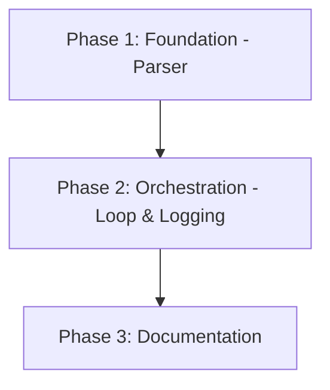

# Implementation Plan: Batch Pipeline Execution

## 1. Plan Overview
- **Total Phases**: 3
- **Agents Involved**: `coder`, `technical_writer`
- **Estimated Effort**: ~1 hour
- **Summary**: Implement a headless execution wrapper (`run-pipeline.sh`) that safely extracts pending URLs from `data/pipeline.md`, invokes the career-ops CLI evaluating each sequentially, and manages failure logging and TSV output staging.

## 2. Dependency Graph

## 3. Execution Strategy Table
| Phase | Objective | Agent | Execution Mode |
|-------|-----------|-------|----------------|
| 1 | Extract pending URLs from pipeline.md | `coder` | Sequential |
| 2 | Orchestrate sequential loop & error handling | `coder` | Sequential |
| 3 | Document new headless workflow | `technical_writer` | Sequential |

## 4. Phase Details

### Phase 1: Foundation - Parser
**Objective**: Create robust extraction logic to safely pull unchecked URLs from `data/pipeline.md`.
**Agent Assignment**: `coder` (Scripting/parsing tasks require implementation expertise).
**Files to Create**: 
- `batch/extract-pipeline.mjs` (or inline bash logic if simpler)
  - **Purpose**: Parse `data/pipeline.md`, finding all `- [ ] <URL>` lines under "## Pendientes".
  - **Output**: Clean newline-separated URLs for the bash loop.
**Validation Criteria**:
- Run `node batch/extract-pipeline.mjs` against `data/pipeline.md` and verify it outputs only the expected ~100+ URLs.
**Dependencies**:
- `blocked_by`: []
- `blocks`: [2]

### Phase 2: Orchestration - Loop & Logging
**Objective**: Implement the headless background wrapper script that executes the evaluation loop.
**Agent Assignment**: `coder`
**Files to Create**:
- `batch/run-pipeline.sh`
  - **Purpose**: Background loop orchestrator.
  - **Details**:
    1. Call `extract-pipeline.mjs` (or native parser) to get the URL list.
    2. Loop through each URL.
    3. Invoke `gemini -p "/career-ops batch \"$URL\""`
    4. Check exit code: If `0`, proceed. If non-zero, append URL to `batch/logs/failed.log`.
    5. Ensure `stdout` and `stderr` are redirected cleanly for observability.
**Validation Criteria**:
- `bash batch/run-pipeline.sh --dry-run` correctly mocks the execution loop and prints the CLI commands without running them.
**Dependencies**:
- `blocked_by`: [1]
- `blocks`: [3]

### Phase 3: Documentation
**Objective**: Document the new batch execution capability for users.
**Agent Assignment**: `technical_writer`
**Files to Modify**:
- `batch/README.md`
  - **Details**: Add a new section on "Headless Pipeline Processing". Explain how to run `nohup bash batch/run-pipeline.sh > batch/logs/batch-run.log 2>&1 &` and how to monitor the `failed.log`.
**Validation Criteria**:
- `cat batch/README.md` contains accurate execution and monitoring commands.
**Dependencies**:
- `blocked_by`: [2]
- `blocks`: []

## 5. File Inventory
| File | Action | Phase | Purpose |
|------|--------|-------|---------|
| `batch/extract-pipeline.mjs` | Create | 1 | Isolate pending URLs |
| `batch/run-pipeline.sh` | Create | 2 | Background orchestrator loop |
| `batch/README.md` | Modify | 3 | Process documentation |

## 6. Risk Classification
- **Phase 1 (Parser)**: LOW - Read-only operation on Markdown.
- **Phase 2 (Orchestration)**: MEDIUM - Shell scripting orchestrating external CLI calls; risk of infinite loops or malformed execution strings if escaping fails.
- **Phase 3 (Documentation)**: LOW - Documentation only.

## 7. Execution Profile
- Total phases: 3
- Parallelizable phases: 0
- Sequential-only phases: 3
- Estimated sequential wall time: ~10 minutes

## 8. Cost Estimation
| Phase | Agent | Model | Est. Input | Est. Output | Est. Cost |
|-------|-------|-------|-----------|------------|----------|
| 1 | `coder` | Flash | 1500 | 200 | ~$0.01 |
| 2 | `coder` | Flash | 2000 | 300 | ~$0.01 |
| 3 | `technical_writer`| Flash | 2000 | 200 | ~$0.01 |
| **Total** | | | **5500** | **700** | **~$0.03** |
